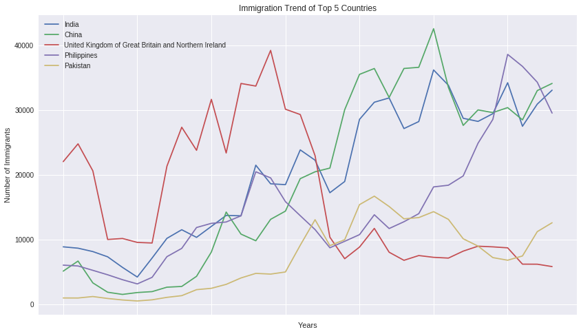
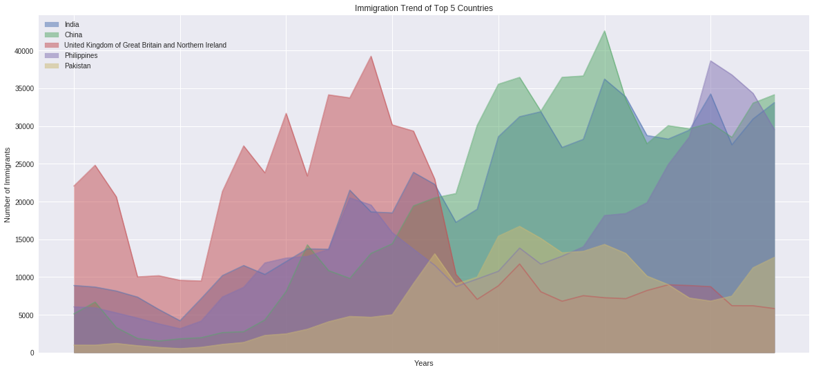
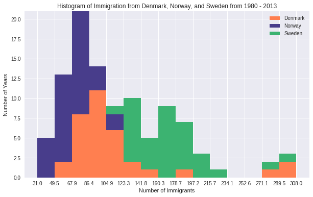
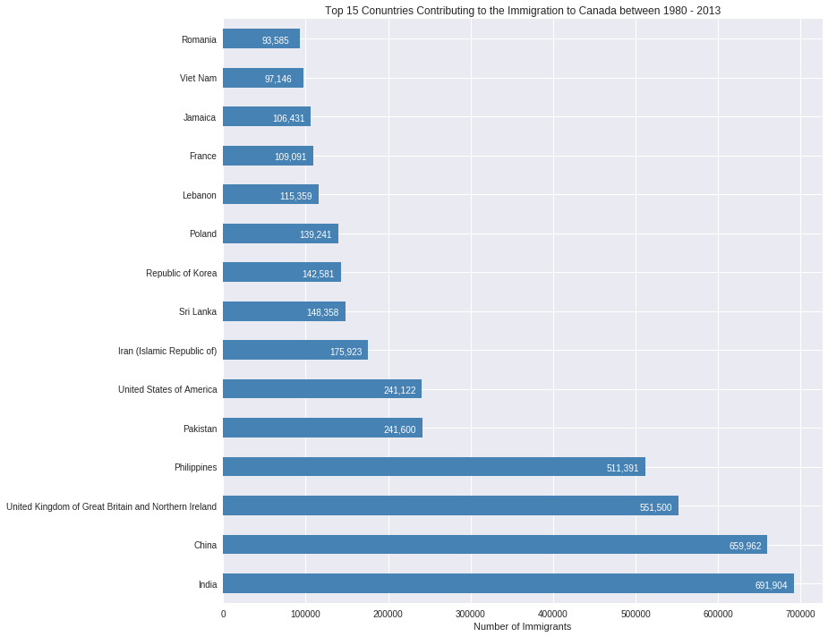
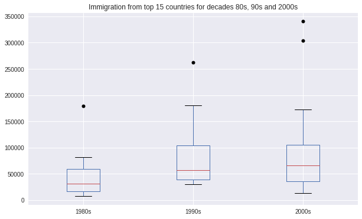
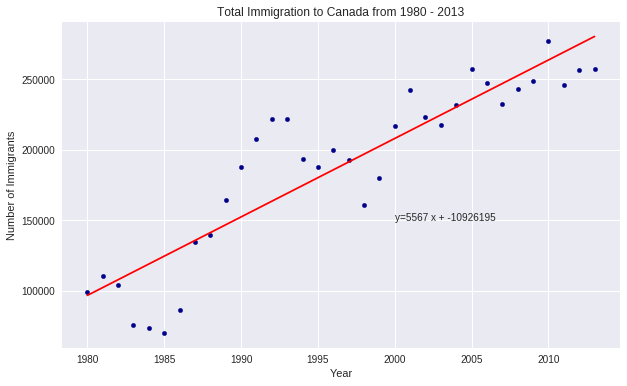
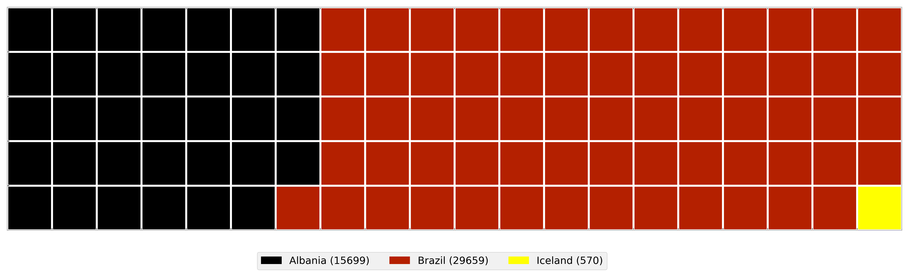

# Minicurso: Análise e Manipulação de Dados com Python

---

## Agenda

1. Introdução ao Pandas
2. Corrigindo os dados
    * Identificar e lidando com valores ausentes
    * Padronização de dados
    * Normalização de dados
    * Binning
3. Análise dos dados
4. Preparando os dados
5. Visualização dos dados
    * Gráficos de Linha
    * Gráficos de Área 
    * Histogramas 
    * Gráficos de Barras 
    * Gráficos de Pizza 
    * Diagrama de Caixa 
    * Gráfico de Dispersão 

6. Extras
   * Waffle Charts
   * Word Clouds
 
## Prévia 

### Visualização de dados com Pandas

### Gráficos de linha

### Gráficos de área 

### Histogramas 

### Gráficos de barras 

### Gráficos de Pizza 

### Diagrama de caixa 

### Gráfico de dispersão 

### Waffle Charts

### Word Clouds

